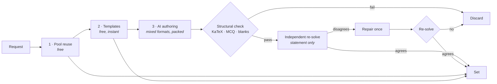

<div align="center">
  

  <h1>lemma</h1>

  <p><strong>Math practice, generated for you.</strong></p>

  <p>
    Build a problem set by course → unit → topic, at the difficulty, style and format you choose.<br>
    Every AI-written problem is re-solved by a second model before it reaches you, and every one
    arrives with a worked solution.
  </p>

  <p>
    
    
    
    
    
  </p>

  <p>
    <a href="docs/self-hosting.md">Self-hosting</a> ·
    <a href="docs/architecture.md">Architecture</a> ·
    <a href="docs/pool-seeding.md">Pool seeding</a> ·
    <a href="SECURITY.md">Security</a>
  </p>
</div>

---

## About

Most practice apps hand you a fixed question bank. lemma writes the questions on demand — but generated math is only useful if it is *correct*, so the interesting part of this codebase is everything between "the model wrote a problem" and "a student sees it": a free structural pass, an independent re-solve by a second model that never sees the answer, one repair attempt, and a discard if it still disagrees.

It runs on Google AI Studio's free tier, so the whole thing costs $0 to operate.

## Features

- **Sets built to order** — 9 courses, 47 units, 103 topics (Foundations through AP Calculus BC and competition math), 5 difficulty levels, 5 problem styles and 8 formats. Up to 15 problems a set.
- **Verified, not just generated** — every problem is structurally validated, then solved from the statement alone by a checker model that never sees the stored answer. Disagreement earns one repair pass, then a discard.
- **Four ways to work a set** — practice, quiz, flashcards, or paper.
- **Print it, do it on paper, scan it back** — a vision model transcribes and marks a photographed worksheet into the same record as typed practice, behind a confidence gate so a misread never becomes permanent history.
- **Start from your own material** — paste notes or upload photos or a PDF. It is read once into a structured digest, the file is deleted, and fresh problems are written in the same shape. Problems written this way are never served to anyone else.
- **Grading that understands math** — `3/4`, `0.75` and `\frac{3}{4}` are the same answer. Wrong answers get a diagnosis of the specific slip, not "incorrect".
- **Interactive graphs** — read a value off a plot, click the lattice points satisfying a condition, or drag handles to produce a curve. Plots render to SVG in Node, so no charting library reaches the browser.
- **A practice record you can't fake** — every score, meter and stat is reconstructed from server-written rows. There is no progress column to forge.
- **Review and stats** — the problems you actually missed, ranked worst-first; accuracy by topic, format, style and difficulty; and one-click sets targeted at your weakest work.
- **Guest-first** — anonymous sign-in by default; linking Google keeps the same user id, so nothing is lost on upgrade.
- **Your data, removable** — clear practice history, delete everything but the account, or delete the account outright. All three immediate.

## How it works

`POST /api/sets` fills a set in cost order and streams progress as SSE:



1. **Pool reuse** — already-verified problems, least-served first, capped at half the set.
2. **Templates** — seeded-RNG generators whose answers are computed, not claimed, so they skip verification.
3. **AI generation** — the requested format mix packed into as few calls as it fits in, with each batch verified the moment it lands.

The packing matters because the free tier meters *requests per day*, not tokens: the number of calls a set makes is what decides how many sets a day exist.

→ [Architecture](docs/architecture.md) for the budgets, the three request branches and the project layout.

## Getting started

```bash
git clone <your-fork-url> lemma
cd lemma
npm install
cp .env.example .env.local   # Supabase URL + keys, and a Gemini API key
npm run dev
```

You need Node 20.9+, a free [Supabase](https://supabase.com) project and a free [Google AI Studio](https://aistudio.google.com/apikey) key. Sign-in also depends on three Supabase dashboard settings that are not in this repo.

→ [Self-hosting](docs/self-hosting.md) for those settings, the full environment table and the CAPTCHA rollout.

## Practice modes

| Mode | Counts toward the set | Reveals the answer | Second attempt |
|---|---|---|---|
| Practice | yes | yes | on a wrong answer |
| Quiz | yes | only after hand-in | no |
| Flashcards | no (unscoped reps) | yes | n/a — repeat freely |
| Scanned work | yes | yes | no — the paper is already written |

## Daily limits

Everything runs on one shared free model quota, so each account is bounded per day. The numbers live in `src/lib/limits.ts` and `/terms` renders them from that same table, so the published figures can't drift from the enforced ones.

| | Guest | Signed in |
|---|---|---|
| Generated sets (only those costing a model call) | 5 | 20 |
| Worksheet scans | 5 | 20 |
| Study materials | 3 | 10 |
| Review sets · shared-set copies | 10 · 10 | 10 · 10 |
| Model-assisted marking | 60 | 200 |

Over the marking budget your answer is still graded — locally — and only the written diagnosis is withheld. There is a second bound per network, and the two layers fail in opposite directions deliberately; see [self-hosting](docs/self-hosting.md#rate-limiting).

## Commands

```bash
npm run dev            # dev server
npm run build          # production build
npm start              # serve the production build
npm run lint           # eslint (next/core-web-vitals + React Compiler rules)
npm run test           # vitest — offline tests only
npm run seed           # pool seeding CLI — `npm run seed -- --help`
npx tsc --noEmit       # typecheck (no npm script for this)
```

`npm run seed` stocks the shared pool offline so builds can fill slots for free, either step by step or unattended — see [pool seeding](docs/pool-seeding.md).

## Contributing

A handful of invariants here are easy to break silently: KaTeX, the Supabase browser SDK, plotting and zod must all stay out of the client bundle, and failure paths degrade rather than throw. `client-bundle.test.ts` turns the first four into a failing test rather than a few hundred quiet kilobytes.

This is also not the Next.js you may know — `params` are Promises, `middleware` is now `proxy.ts`. Read the relevant guide in `node_modules/next/dist/docs/` before writing route code.

→ [Architecture](docs/architecture.md#invariants-that-fail-silently) for the full list, and `CLAUDE.md` for the reasoning behind each.

## Roadmap

- **Spaced repetition** on top of the review queue, so a topic resurfaces on a schedule rather than only when you go looking for it
- **A problem quality loop** — feeding grading disagreements and reported problems back into the pool, so a bad problem that survives verification is retired rather than served forever
