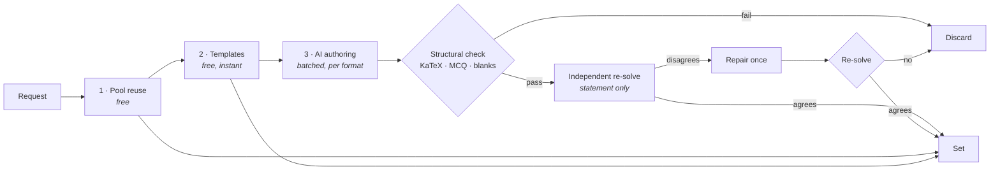

<div align="center">
  

  <h1>lemma</h1>

  <p><strong>Math practice, generated for you.</strong></p>

  <p>
    Build a problem set by course → unit → topic, at the difficulty, style and format you choose.<br>
    Every AI-written problem is re-solved by a second model before it reaches you, and every one
    arrives with a worked solution.
  </p>

  <p>
    
    
    
    
    
  </p>
</div>

---

Most practice apps hand you a fixed question bank. lemma writes the questions on demand — but generated math is only useful if it is *correct*, so the interesting part of this codebase is everything that happens between "the model wrote a problem" and "a student sees it": a free structural pass, an independent re-solve by a second model that never sees the answer, one repair attempt, and a discard if it still disagrees.

It runs on Google AI Studio's free tier, so the whole thing costs $0 to operate.

## Features

- **Sets built to order** — 9 courses, 47 units, 103 topics (Foundations through AP Calculus BC and competition math), 5 difficulty levels, 5 problem styles (drill, word, conceptual, proof, error analysis) and 8 formats (multiple choice, open answer, fill-in-the-blank, select-all, order-the-steps, matching, multi-part, and graph). Up to 15 problems a set.
- **Verified, not just generated** — each problem is structurally validated, then solved from the statement alone by a checker model that never sees the stored answer. Disagreement earns one repair pass, then a discard.
- **Graphs you interact with, three ways** — read a value off a plot, click the lattice points that satisfy a condition, or drag handles to produce a curve. One DB format, three tasks. Plots render to SVG in Node, so no charting library reaches the browser.
- **Four ways to work a set** — practice (graded, one retry, solutions on demand), quiz (nothing disclosed until you hand it in), flashcards (unscored, infinitely repeatable), and paper.
- **Print it, do it on paper, scan it back** — print a worksheet with optional answer key, work it by hand, then photograph it. A vision model transcribes and marks it into the same record as typed practice, behind a confidence gate so a misread never becomes permanent history.
- **Grading that understands math** — `3/4`, `0.75` and `\frac{3}{4}` are the same answer. A local normalizer settles almost everything; only genuinely ambiguous cases cost a model call. Wrong answers get a diagnosis of the specific slip, not "incorrect".
- **A practice record you can't fake** — every score, meter and stat is reconstructed from `attempts` rows written server-side. There is no progress column to forge.
- **Review queue** — the problems you actually missed, ranked worst-first, rebuilt into a fresh set for free.
- **Stats and prescriptions** — accuracy by topic, format, style and difficulty; recurring-mistake analysis; and one-click sets targeted at your weakest work, with the targeting config derived server-side from your own history.
- **Study sessions and sharing** — scope stats to a single sitting, or hand a set to someone else with a share link (which grants a *copy*, never access to your record).
- **Instant, free drills** — 16 deterministic templates with computed answers and authored explanations skip the model entirely.
- **Guest-first** — anonymous sign-in by default; linking Google keeps the same user id, so nothing you've done is lost on upgrade.
- **Your data, removable** — `/account` clears practice history, deletes everything but the account, or deletes the account outright. All three are immediate, and storage is swept before the database cascade so no orphaned files survive.

## How it works

`POST /api/sets` (`maxDuration = 300`) fills a set in cost order and streams progress as SSE:



1. **Pool reuse** — already-verified problems matching your request, excluding anything you attempted in the last 30 days, least-served first. Capped at half the set.
2. **Templates** — seeded-RNG parametrized generators. The answer is computed, not claimed, so they skip verification entirely.
3. **AI generation** — one batched authoring call per format, then verification fanned out at a bounded concurrency.

Two budgets exist because a short set beats no set: a 230s build deadline stops *starting* new rounds inside the route's 300s limit, and capacity failures break out of the loop with whatever was already gathered rather than throwing.

> [!NOTE]
> Every model call in the app goes through one function, `callStructured()` in `src/lib/ai/provider.ts`. It returns `null` for unusable output (callers must degrade) and throws only when the entire model chain is rate-limited. Swapping providers is a change to that one file.

### Practice modes

Each mode is defined by three answers, which the grading route reads from one table (`src/lib/attempt-state.ts`):

| Mode | Counts toward the set | Reveals the answer | Second attempt |
|---|---|---|---|
| Practice | yes | yes | on a wrong answer |
| Quiz | yes | only after hand-in | no |
| Flashcards | no (unscoped reps) | yes | n/a — repeat freely |
| Scanned work | yes | yes | no — the paper is already written |

### Daily limits

Everything runs on one shared free model quota, so each account is bounded per day. The numbers live in `src/lib/limits.ts` and the `/terms` page renders them from that same table, so the published figures can't drift from the enforced ones.

| | Guest | Signed in |
|---|---|---|
| Generated sets (only those costing a model call) | 5 | 20 |
| Worksheet scans | 5 | 20 |
| Review sets · shared-set copies | 10 · 10 | 10 · 10 |
| Model-assisted marking | 60 | 200 |

Over the marking budget your answer is still graded — locally — and only the written diagnosis is withheld. That is the same degradation that already happens when the provider is unreachable, which is why it is safe to reach deliberately.

> [!NOTE]
> Anonymous sessions are issued by Supabase straight to the browser, so nothing in this codebase sees them. Per-user caps bound casual overuse; the defence against farming fresh guest accounts is Supabase's own auth rate limiting, which is a dashboard setting.

## Getting started

### Prerequisites

- Node.js 20+
- A [Supabase](https://supabase.com) project (free tier)
- A [Google AI Studio](https://aistudio.google.com/apikey) API key (free, no card)

### Install

```bash
git clone <your-fork-url> lemma
cd lemma
npm install
cp .env.example .env.local   # then fill it in — see below
npm run dev
```

### Configure Supabase

Three settings, none of which live in this repo, and all three are needed for sign-in to work:

1. **Authentication → Sign In / Providers → "Anonymous sign-ins"**. Required — guest mode is the default path through the app.
2. **Authentication → Sign In / Providers → "Allow manual linking"**. Also required, and **off by default**. `linkIdentity()` is what upgrades a guest to a Google account without changing their user id; without this every guest sign-in fails with `404 manual_linking_disabled`.
3. **The Google provider**, with a client ID and secret from Google Cloud Console. The OAuth client's redirect URI must point at `https://<project>.supabase.co/auth/v1/callback` — Supabase, *not* your app. With the provider off you get `400 validation_failed / "provider is not enabled"`.

Then add your deployed origin under **Authentication → URL Configuration** (Site URL and Redirect URLs), since sign-in derives its redirect from `window.location.origin`.

> [!TIP]
> None of this is visible from the code, so when sign-in fails, read `error_code` in the Supabase auth logs first. `src/lib/auth-errors.ts` maps those codes to the copy shown on `/signin`, and the callback forwards the real code rather than a generic flag precisely so the page can name the cause.

> [!IMPORTANT]
> There is no local database and no SQL in this repo. The schema lives in the Supabase project's migration history (`catalog`, `problems`, `sets_attempts_uploads`, `rls_and_storage`, `seed_catalog`, `bump_times_served_fn`, `lock_down_bump_times_served`, `harden_rls_client_read_only`, `study_sessions_and_coach_reads`, `add_problem_formats`, `attempt_retries`, `catalog_foundations_geometry_stats`). Inspect and change it through the Supabase MCP server configured in `.mcp.json`.

### Environment variables

| Variable | Required | Notes |
|---|---|---|
| `NEXT_PUBLIC_SUPABASE_URL` | yes | Project Settings → API |
| `NEXT_PUBLIC_SUPABASE_PUBLISHABLE_KEY` | yes | Same page. The current key format — the legacy `anon` JWT is deprecated |
| `SUPABASE_SECRET_KEY` | yes | "Secret keys" → create one. **Server-only, bypasses RLS** |
| `GEMINI_API_KEY` | yes | [aistudio.google.com/apikey](https://aistudio.google.com/apikey) |
| `NEXT_PUBLIC_SITE_URL` | no | The canonical origin: metadata base, Open Graph and canonical URLs, and the host in `robots.txt` / `sitemap.xml`. Unset, `siteUrl()` falls back to Vercel's own `VERCEL_PROJECT_PRODUCTION_URL`, then `VERCEL_URL`, then `http://localhost:3000` — so a Vercel deploy is correct with nothing configured. Auth does **not** use it; sign-in derives its redirect from `window.location.origin` |
| `GEMINI_GENERATOR_MODELS` | no | `gemini-3.5-flash,gemini-3.6-flash,gemini-2.5-flash` |
| `GEMINI_CHECKER_MODELS` | no | `gemini-3.5-flash-lite,gemini-2.5-flash-lite,gemini-2.5-flash` |
| `GEMINI_CONCURRENCY` | no | `3` — free-tier limits are around 10 RPM |

The two model variables are comma-separated **preference-ordered chains**: later entries are tried only when earlier ones are rate-limited or overloaded, because free-tier Flash models return 503 in bursts.

> [!TIP]
> Only Flash and Flash-Lite tiers are free. Pointing these at a Pro model works, but stops being free.

### Commands

```bash
npm run dev            # dev server
npm run build          # production build
npm start              # serve the production build
npm run lint           # eslint (next/core-web-vitals + React Compiler rules)
npm run test           # vitest — offline tests only
npx tsc --noEmit       # typecheck (no npm script for this)
```

## Testing

```bash
npx vitest run src/lib/__tests__/core.test.ts   # one file
npx vitest run -t "normalizeMath"               # one test by name
```

- **`core.test.ts`** — answer normalization and comparison, plus a structural validation of every template across 25 seeds × every declared difficulty and format.
- **`formats.test.ts`** — the per-format round trip: author → split into DB columns → grade → render → print. Keyed off `PROBLEM_FORMATS`, so a new format without a fixture fails here rather than in production.
- **`disclosure.test.ts`** — the rule deciding whether the answer key is in a response, stated as an invariant: across every mode and prior state, nothing both offers a retry and discloses the answer.
- **`coach-plan.test.ts`** — targeted-set configuration. A security boundary as much as a feature: `focus.directives` reaches a model prompt verbatim, so this asserts what comes out is always buildable and that mistake notes are flattened before they land inside a quoted string.
- **`production.test.ts`** — the CSP builder, the daily-limit table, `siteUrl()` resolution order, sign-in error copy, and the share-code guard.
- **`analytics.test.ts`** — streaks, smoothing and weakness ranking, run against a pure `aggregate()`.
- **`plot.test.ts`** — plot geometry and SVG output, which is a pure string.
- **`scan.test.ts`** — the "not attempted" rule that keeps a blank from being recorded as a miss.
- **`provider-schema.test.ts`** — asserts no schema sent to a model contains `$ref` / `$defs` / `$schema`. Gemini only supports `$ref` in non-required properties, and a regression fails at request time with an opaque 400.
- **`live-provider.test.ts`** and **`live-account.test.ts`** — hit the real API and the real database, and self-skip without their key, so `npm run test` stays offline:

  ```bash
  node --env-file=.env.local ./node_modules/vitest/vitest.mjs run src/lib/__tests__/live-provider.test.ts
  node --env-file=.env.local ./node_modules/vitest/vitest.mjs run src/lib/__tests__/live-account.test.ts
  ```

## Project structure

```
src/
├── app/                 # routes — every page is a Server Component
│   ├── api/sets/        # SSE set builder (maxDuration 300)
│   ├── api/check/       # the only path that ever returns an answer key
│   ├── api/scan/        # marks a photographed worksheet
│   ├── build/ sets/     # builder + library
│   ├── set/[id]/        # practice · quiz · flashcards · scan · print
│   ├── review/ stats/   # missed-problem queue · analytics + prescriptions
│   ├── account/         # clear history · delete data · delete account
│   ├── privacy/ terms/  # the legal pages
│   ├── signin/          # owns the sign-in attempt and names its failures
│   └── s/[code]/        # shared-set landing
├── components/          # client components; practice engines, inputs, design bits
├── lib/
│   ├── ai/              # provider, schemas, generation, verification, grading, coach
│   ├── templates/       # deterministic parametrized generators
│   ├── supabase/        # three clients: browser · server (RLS) · service (bypasses RLS)
│   ├── sets.ts          # the build pipeline
│   ├── answers.ts       # normalizeMath and the local grading ladder
│   ├── analytics.ts     # stats derived from attempts
│   ├── limits.ts        # every daily cap, in one table
│   ├── env.ts           # every environment variable, read in one place
│   ├── csp.ts           # the per-request Content-Security-Policy
│   ├── plot.ts          # declarative plot spec → SVG, server-side only
│   ├── print-key.ts     # answer keys for printed worksheets
│   ├── worksheets.ts    # scan uploads and their grading
│   ├── account.ts       # the three levels of data deletion
│   └── math-render.ts   # KaTeX, server-side only
└── proxy.ts             # Next 16's renamed middleware — session refresh + CSP nonce
```

## Security model

The `problems` table holds answer keys, so the design assumes the client is hostile.

- **`problems` has RLS enabled with no policies** — deny-all. It is read server-side only, and `loadSetForUser()` strips every row into a `SanitizedProblem` before anything renders.
- **`/api/check` is the only path that discloses an answer**, and it first proves the problem appears in a set the caller owns. Problems are pooled across users, so checking the set id alone would leak arbitrary answer keys. Its `recall` action (replaying an outcome you already earned) additionally requires that an attempt exists, so it can't read an answer early.
- **A live retry offer and the answer key are mutually exclusive** — handing over the key beside a "Try again" button would turn the second attempt into a copying exercise.
- **Outcomes are written exclusively server-side.** Clients get read-only access to their own sets, items and attempts. That is what makes the derived progress, meters and stats trustworthy.
- **Targeted sets take a plan id and nothing else.** The topics, difficulty and above all the authoring *directives* are rebuilt server-side from the caller's own history, because `focus.directives` lands verbatim in a model prompt.
- **A share link grants a copy, not access.** Opening one shows sanitized problems and offers to mint a set you own; widening the ownership check to "or you know the code" would have been the smaller diff and the much larger attack surface.
- **Deleting a set relies on the `delete own sets` RLS policy** as the authorization check, so a forged id matches no rows. `problem_set_items` cascades; `attempts.set_id` is `ON DELETE SET NULL`, so practice history outlives the set it was earned in.
- **Guests are Supabase anonymous users**, carrying the `authenticated` role, so every `auth.uid()`-scoped policy covers them unchanged. Google sign-in uses `linkIdentity()`, preserving the user id and therefore the history.

Daily bounds: 5 generated sets for guests, 20 signed-in (only sets that cost a model call count), plus 10 review sets and 10 shared-set copies.

> [!WARNING]
> A guest's identity lives only in their session cookie. Clearing it orphans their sets permanently — to test the signed-out state, fetch with `credentials: "omit"` instead.

### Accepted advisor findings

Two Supabase advisor items are expected here rather than bugs:

- **`rls_enabled_no_policy` on `problems` (INFO)** — deliberate. No policy means deny-all, which is what a table of answer keys should be.
- **`auth_allow_anonymous_sign_ins` (WARN)** — flagged because anonymous sign-ins are on, so `authenticated`-role policies also cover guests. That is the product requirement; every one of those policies is still scoped to `auth.uid()`.

Still open: leaked-password protection is off. It doesn't apply today (anonymous + Google only, no passwords), but turn it on before adding email/password sign-in.

### Headers

`next.config.ts` sets HSTS, `X-Content-Type-Options`, `X-Frame-Options`, `Referrer-Policy` and `Permissions-Policy` for every response. The Content-Security-Policy is built per request in `src/proxy.ts` instead, because it carries a nonce: Next reads the nonce out of the request's CSP header and stamps it onto every script it emits, so `script-src` needs no `'unsafe-inline'`. The usual objection to nonces — that they force dynamic rendering — costs nothing here, since every page already sets `force-dynamic`.

`style-src` keeps `'unsafe-inline'` deliberately. A nonce there would *disable* it (CSP ignores `'unsafe-inline'` once a nonce is present), breaking progress meters and `next/font`, to defend against a far smaller risk than script injection.

## Privacy

`/privacy` and `/terms` describe what the app actually does, and are worth reading before deploying your own instance — particularly the note that content sent through the free tier of Google AI Studio may be reviewed by Google. That matters most for worksheet scans, which can carry a student's name and handwriting. `/account` offers three levels of deletion, all immediate, with storage swept before the database cascade so no orphaned files survive.

## Notes for contributors

A few invariants here are easy to break silently and none of them fail loudly:

- **KaTeX must never reach the browser.** `src/lib/math-render.ts` runs it in Node; `src/components/latex.tsx` only injects the resulting HTML. Importing `katex` from a Client Component adds ~275 kB.
- **The Supabase browser SDK is lazily imported.** Auth is resolved server-side and passed down as a plain prop; `@/lib/auth` is `await import(...)`-ed at the point of a click. A top-level import puts ~64 kB gzipped back on every route.
- **Failure paths degrade, they don't throw** — partial sets, discarded problems, `null` returns. Keep that when adding pipeline steps.
- **Correctness is never colour alone.** Every ok/bad state pairs colour with an icon and a word, and the oxblood accent never appears inside a graded answer region.
- **This is not the Next.js you know.** Read the relevant guide in `node_modules/next/dist/docs/` before writing route code; `params` are Promises and `middleware` is now `proxy.ts`.

`CLAUDE.md` and `AGENTS.md` carry the longer version of all of this.

## Roadmap

Everything previously listed here — worksheet scanning, graph questions, the matching and multi-part formats, and printable worksheets with answer keys — has shipped. What's left:

- **Spaced repetition** on top of the review queue, so a topic resurfaces on a schedule rather than only when you go looking for it
- **A problem quality loop** — feeding grading disagreements and reported problems back into the pool, so a bad problem that survives verification is retired rather than served forever
