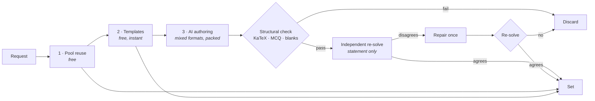

<div align="center">
  

  <h1>lemma</h1>

  <p><strong>Math practice, generated for you.</strong></p>

  <p>
    Build a problem set by course → unit → topic, at the difficulty, style and format you choose.<br>
    Every AI-written problem is re-solved by a second model before it reaches you, and every one
    arrives with a worked solution.
  </p>

  <p>
    
    
    
    
    
  </p>
</div>

---

Most practice apps hand you a fixed question bank. lemma writes the questions on demand — but generated math is only useful if it is *correct*, so the interesting part of this codebase is everything that happens between "the model wrote a problem" and "a student sees it": a free structural pass, an independent re-solve by a second model that never sees the answer, one repair attempt, and a discard if it still disagrees.

It runs on Google AI Studio's free tier, so the whole thing costs $0 to operate.

## Features

- **Sets built to order** — 9 courses, 47 units, 103 topics (Foundations through AP Calculus BC and competition math), 5 difficulty levels, 5 problem styles (drill, word, conceptual, proof, error analysis) and 8 formats (multiple choice, open answer, fill-in-the-blank, select-all, order-the-steps, matching, multi-part, and graph). Up to 15 problems a set.
- **Verified, not just generated** — each problem is structurally validated, then solved from the statement alone by a checker model that never sees the stored answer. Disagreement earns one repair pass, then a discard.
- **Graphs you interact with, three ways** — read a value off a plot, click the lattice points that satisfy a condition, or drag handles to produce a curve. One DB format, three tasks. Plots render to SVG in Node, so no charting library reaches the browser.
- **Four ways to work a set** — practice (graded, one retry, solutions on demand), quiz (nothing disclosed until you hand it in), flashcards (unscored, infinitely repeatable), and paper.
- **Print it, do it on paper, scan it back** — print a worksheet with optional answer key, work it by hand, then photograph it. A vision model transcribes and marks it into the same record as typed practice, behind a confidence gate so a misread never becomes permanent history.
- **Start from your own material** — paste your notes or upload photos or a PDF of a worksheet or chapter. It is read once into a structured digest — topics, level, and the kinds of task in it — and the file is then deleted; fresh problems are written in the same shape, at that level or a step either side. An optional note ("more of these but harder") steers it. Problems written this way are never served to anyone else.
- **Grading that understands math** — `3/4`, `0.75` and `\frac{3}{4}` are the same answer. A local normalizer settles almost everything; only genuinely ambiguous cases cost a model call. Wrong answers get a diagnosis of the specific slip, not "incorrect".
- **A practice record you can't fake** — every score, meter and stat is reconstructed from `attempts` rows written server-side. There is no progress column to forge.
- **Review queue** — the problems you actually missed, ranked worst-first, rebuilt into a fresh set for free.
- **Stats and prescriptions** — accuracy by topic, format, style and difficulty; recurring-mistake analysis; and one-click sets targeted at your weakest work, with the targeting config derived server-side from your own history.
- **Study sessions and sharing** — scope stats to a single sitting, or hand a set to someone else with a share link (which grants a *copy*, never access to your record).
- **Instant, free drills** — 16 deterministic templates with computed answers and authored explanations skip the model entirely.
- **Guest-first** — anonymous sign-in by default; linking Google keeps the same user id, so nothing you've done is lost on upgrade.
- **Your data, removable** — `/account` clears practice history, deletes everything but the account, or deletes the account outright. All three are immediate, and storage is swept before the database cascade so no orphaned files survive.

## How it works

`POST /api/sets` (`maxDuration = 300`) fills a set in cost order and streams progress as SSE:



1. **Pool reuse** — already-verified problems matching your request, excluding anything you attempted in the last 30 days, least-served first. Capped at half the set.
2. **Templates** — seeded-RNG parametrized generators. The answer is computed, not claimed, so they skip verification entirely.
3. **AI generation** — the requested mix of formats packed into as few authoring calls as it fits in, with verification of each batch starting the moment that batch lands. Authoring and verification share one concurrency budget.

The packing is the whole ballgame on a free tier that meters *requests per day* rather than tokens: a call costs about the same whatever it carries, so the number of calls a set makes is what decides how many sets a day exist. Splitting per format instead made a six-problem set cost twelve requests; it now costs three.

Two budgets exist because a short set beats no set: a 230s build deadline stops *starting* new rounds inside the route's 300s limit, and capacity failures break out of the loop with whatever was already gathered rather than throwing.

The route has three branches into that pipeline. **Manual** takes the builder form's settings. **Targeted** takes a plan id and rebuilds the config from your own practice record. **Material** takes the id of something you uploaded and reads its stored digest. The last two skip steps 1 and 2 entirely — a set sold as written for you cannot be filled from a pool authored for whoever asked first — and both rebuild everything that reaches a prompt server-side, because a client that could write those strings could write the authoring instructions.

> [!NOTE]
> Every model call in the app goes through one function, `callStructured()` in `src/lib/ai/provider.ts`. It returns `null` for unusable output (callers must degrade) and throws only when the entire model chain is rate-limited. Swapping providers is a change to that one file.

### Seeding the pool by hand

Step 1 is the only free slot in a build, and today it only fills as a side effect of builds that already paid for it. `npm run seed` stocks it deliberately — the authoring and the checking are done by whoever runs the tool, not by the provider, so the problems cost daily quota nothing and every set that reuses them is cheaper for good.

Three steps, with a file between each:

```bash
npm run seed -- census                       # what the pool holds, per topic and difficulty
npm run seed -- plan --topics multi-step-linear --difficulty 3 --count 12 \
                     --styles word,conceptual --formats mcq,open
# author .seed/authored.json from .seed/authoring-brief.md
npm run seed -- solve                        # writes the statements, with no answers
# solve them into .seed/solved.json
npm run seed -- ingest [--dry-run]           # gates them, writes what passes as `active`
```

The briefs are assembled from `GENERATOR_SYSTEM_PROMPT`, `buildUserMessage` and `solverPrompt` — the same code paths the live pipeline uses — and `ingest` runs `structuralCheck` and `solverGates`, not a copy of them. A seeded problem clears exactly the bar a generated one clears.

> [!IMPORTANT]
> **Solve in a context that has not seen the answers.** `.seed/authored.json` holds the key, the worked solution and the distractor rationales, and the solve step exists to disagree with them. Run it fresh — it needs no database and no key, which is what makes that easy. Solving in the session that authored the batch produces a verified stamp on an unverified problem, and nothing downstream re-checks it.

Two things it does not do. It does not help **targeted or material sets** — those skip pool reuse by design, and pay the AI cost for every slot. And it writes no `drill` you couldn't have had for free: templates already serve that style deterministically, so the cells worth your own time are the non-drill ones the census marks thin.

`.seed/` is gitignored, deliberately rather than incidentally: between `plan` and `ingest` it holds answer keys for problems about to be served.

#### Running it unattended

`auto` is the same three steps in a loop, with `claude -p` in the author's chair. Start it, leave it running for as long as you like, stop it whenever:

```powershell
npm run seed -- auto --forever --jobs 2 *> .seed/auto.log   # its own terminal, or detached
npm run seed -- stop                                        # from any window, whenever you're done
```

`--jobs` is how fast it goes and also how quickly it runs into your subscription's rate limit, which shows up as cells timing out rather than as an error — 2 or 3 alongside your own Claude Code session is about right.

Each round it re-censuses the pool, ranks the (topic, difficulty) cells it is thinnest at, and works down them thinnest first. Once every cell has reached `--target`, it raises the target and goes round again — so it deepens the whole catalog evenly rather than ever declaring itself finished.

`stop` writes a file the loop checks before each cell, so it finishes what it is holding and exits cleanly; it exists because a run in another window has no Ctrl-C to receive. Ctrl-C does the same thing when you have one, and a second one quits immediately and takes the subprocesses with it.

It also stops itself if something is actually broken: three cells in a row that author nothing at all (no `claude` on `PATH`, a subscription that has stopped answering) end the run, while ten in a row that author fine and have everything rejected are tolerated first — that is a hard patch of the catalog, not a broken tool.

It needs the `claude` CLI on `PATH` and signs in however that CLI already does. Nothing about the pipeline changes: the same briefs, the same `structuralCheck` and `solverGates`, the same `insertProblems`.

**Coverage is systematic rather than exhaustive per batch.** A cell is one topic at one difficulty; each visit asks for a rotating slice of the styles and formats, because a dozen problems spread over four styles and eight formats is one or two of each at the worst possible request count. Depth is still measured over the *whole* requested vocabulary, so a cell keeps coming back until it is stocked across all of it. `drill` is left out by default — templates already serve it free and deterministically.

**`--verify` is the one real choice.** `gemini` (the default) checks each batch with `solveBatch` — the pipeline's own solver, a different model that never sees the workspace, at roughly three requests per twelve problems. `claude` spends no provider quota at all and is weaker: an author and a checker that are the same model share their blind spots, which is the same objection that makes Gemini-writes-Gemini-checks worth distrusting in the first place. The isolation there is a directory holding the statements and nothing else, plus a brief that says so — not a sandbox.

The requests `gemini` verification costs are worth putting next to what they buy: a pool problem is authored once and reused for as long as it lives, against the five requests a build spends every time it has to write one from scratch.

Expect four to seven minutes per cell, nearly all of it authoring — the exotic formats (`ordering`, `matching`, `multi_select`) run noticeably slower than `mcq` and `open`. Expect a real rejection rate too: the gates reject on genuine disagreement, and they reject more at difficulty 4 than at 2. Stopping is always safe: a cell is written before the next one starts, the ranking is deterministic, and a successful cell's workspace is swept so the answer keys don't pile up. What stays under `.seed/auto/` is the cells that failed, which are the only ones worth opening.

### Practice modes

Each mode is defined by three answers, which the grading route reads from one table (`src/lib/attempt-state.ts`):

| Mode | Counts toward the set | Reveals the answer | Second attempt |
|---|---|---|---|
| Practice | yes | yes | on a wrong answer |
| Quiz | yes | only after hand-in | no |
| Flashcards | no (unscoped reps) | yes | n/a — repeat freely |
| Scanned work | yes | yes | no — the paper is already written |

### Daily limits

Everything runs on one shared free model quota, so each account is bounded per day. The numbers live in `src/lib/limits.ts` and the `/terms` page renders them from that same table, so the published figures can't drift from the enforced ones.

| | Guest | Signed in |
|---|---|---|
| Generated sets (only those costing a model call) | 5 | 20 |
| Worksheet scans | 5 | 20 |
| Study materials | 3 | 10 |
| Review sets · shared-set copies | 10 · 10 | 10 · 10 |
| Model-assisted marking | 60 | 200 |

Over the marking budget your answer is still graded — locally — and only the written diagnosis is withheld. That is the same degradation that already happens when the provider is unreachable, which is why it is safe to reach deliberately.

**There is a second layer, per network.** Anonymous sessions are issued by Supabase straight to the browser, so a per-account cap only bounds casual overuse — someone minting fresh guest accounts gets a fresh allowance each time. `IP_LIMITS` in the same file adds a burst window and a daily ceiling per address, checked through the `rate_check` RPC against a `rate_events` table. The address comes from `x-vercel-forwarded-for` in preference to `x-forwarded-for`, since only the former is stamped at the edge and cannot be chosen by the caller, and it is stored as a salted hash rather than an address.

The two layers fail in opposite directions, deliberately. A per-account cap that cannot read its own count **refuses**, because it is the only thing between one account and unbounded model spend. The per-network check **allows**, because it sits behind a bound that is already working, and refusing would make every set in the app depend on one more table being healthy.

> [!NOTE]
> Those numbers err generous. A classroom or library behind one address looks exactly like a script, and a false positive there reads to a student as the site being broken — so every refusal is logged, and the daily figures are the place to tune.

### Guest sign-up protection

Anyone can create a guest account here without an email address, which is the point — and also means a script could create them in bulk, each with a fresh daily allowance. `src/lib/captcha.ts` runs a Cloudflare Turnstile check once, at the moment a guest session is first created, and never again.

It is **off unless `NEXT_PUBLIC_TURNSTILE_SITE_KEY` is set**: with no key nothing loads, Cloudflare is never contacted, and guest sign-in behaves exactly as it did before. Turning it on is two switches that must move together:

1. Set `NEXT_PUBLIC_TURNSTILE_SITE_KEY` (site key from the Cloudflare dashboard, free) and deploy.
2. **Authentication → Attack Protection** in Supabase: enable Turnstile and paste the matching secret.

> [!WARNING]
> Doing (2) without (1) breaks **every** guest session, which is the default path through the whole app. Always set the key and deploy first. The reverse order is harmless — a token is simply ignored until Supabase is checking for one.

## Getting started

### Prerequisites

- Node.js 20.9+ (what Next 16 requires; CI runs 22)
- A [Supabase](https://supabase.com) project (free tier)
- A [Google AI Studio](https://aistudio.google.com/apikey) API key (free, no card)

### Install

```bash
git clone <your-fork-url> lemma
cd lemma
npm install
cp .env.example .env.local   # then fill it in — see below
npm run dev
```

### Configure Supabase

Three settings, none of which live in this repo, and all three are needed for sign-in to work:

1. **Authentication → Sign In / Providers → "Anonymous sign-ins"**. Required — guest mode is the default path through the app.
2. **Authentication → Sign In / Providers → "Allow manual linking"**. Also required, and **off by default**. `linkIdentity()` is what upgrades a guest to a Google account without changing their user id; without this every guest sign-in fails with `404 manual_linking_disabled`.
3. **The Google provider**, with a client ID and secret from Google Cloud Console. The OAuth client's redirect URI must point at `https://<project>.supabase.co/auth/v1/callback` — Supabase, *not* your app. With the provider off you get `400 validation_failed / "provider is not enabled"`.

Then add your deployed origin under **Authentication → URL Configuration** (Site URL and Redirect URLs), since sign-in derives its redirect from `window.location.origin`.

> [!TIP]
> None of this is visible from the code, so when sign-in fails, read `error_code` in the Supabase auth logs first. `src/lib/auth-errors.ts` maps those codes to the copy shown on `/signin`, and the callback forwards the real code rather than a generic flag precisely so the page can name the cause.

> [!IMPORTANT]
> There is no local database and no SQL in this repo. The schema lives in the Supabase project's migration history — run `list_migrations` through the Supabase MCP server configured in `.mcp.json` to see it, and `apply_migration` to change it. An enumeration here would go stale the first time a migration was applied, which is exactly what happened to the one this replaced.

### Environment variables

| Variable | Required | Notes |
|---|---|---|
| `NEXT_PUBLIC_SUPABASE_URL` | yes | Project Settings → API |
| `NEXT_PUBLIC_SUPABASE_PUBLISHABLE_KEY` | yes | Same page. The current key format — the legacy `anon` JWT is deprecated |
| `SUPABASE_SECRET_KEY` | yes | "Secret keys" → create one. **Server-only, bypasses RLS** |
| `GEMINI_API_KEY` | yes | [aistudio.google.com/apikey](https://aistudio.google.com/apikey) |
| `NEXT_PUBLIC_SITE_URL` | no | The canonical origin: metadata base, Open Graph and canonical URLs, and the host in `robots.txt` / `sitemap.xml`. See the note below on where it sits in the order. Auth does **not** use it; sign-in derives its redirect from `window.location.origin` |
| `GEMINI_GENERATOR_MODELS` | no | `gemini-3.5-flash,gemini-3.6-flash,gemini-3.5-flash-lite,gemini-3.1-flash-lite` |
| `GEMINI_CHECKER_MODELS` | no | `gemini-3.5-flash-lite,gemini-3.1-flash-lite,gemini-flash-lite-latest` |
| `GEMINI_CONCURRENCY` | no | `6` — the whole build's budget against free-tier limits of around 10 RPM, shared by authoring and verification |
| `GEMINI_PROBLEMS_PER_CALL` | no | `6` — problems per authoring call. A request-count dial, not a latency one |
| `GEMINI_SOLVES_PER_CALL` | no | `5` — problems per verification call. Deliberately smaller: a long shared context is where a solver starts pattern-matching between problems instead of solving each |
| `NEXT_PUBLIC_TURNSTILE_SITE_KEY` | no | Cloudflare Turnstile site key. Unset, the guest-sign-up check is off entirely and nothing is loaded. Must be set **before** enabling CAPTCHA in Supabase — see [Guest sign-up protection](#guest-sign-up-protection) |

The two model variables are comma-separated **preference-ordered chains**: later entries are tried only when earlier ones are rate-limited or overloaded, because free-tier Flash models return 503 in bursts. The strong models lead and the lites catch what falls through — which only works if the tail is alive, and once wasn't: `gemini-2.5-flash` sat at the end of both chains and had started answering 404, so the fallback that was supposed to absorb a rate-limited flash absorbed nothing.

> [!TIP]
> Only Flash and Flash-Lite tiers are free. Pointing these at a Pro model works, but stops being free.

**`siteUrl()` resolves the canonical origin in this order**, and the first branch is the one that matters:

1. `VERCEL_ENV === "preview"` with `VERCEL_URL` — **a preview describes itself, ahead of anything configured.** `NEXT_PUBLIC_SITE_URL` is set once per Vercel project and applies to every environment, so with it checked first every preview deployment answered with the production origin: a `robots.txt` pointing at the real sitemap, canonicals claiming the real pages, and a link to a preview unfurling as the live site.
2. `NEXT_PUBLIC_SITE_URL`
3. `VERCEL_PROJECT_PRODUCTION_URL` — the project's production domain
4. `VERCEL_URL` — this specific deployment
5. `http://localhost:3000`, with a warning

So a Vercel deploy is correct with nothing configured. It warns rather than throwing on the last step, because throwing would fail a plain `npm run build` on a developer's machine — but **nothing in that chain may ever produce a host the deployment does not serve**, which is what the hardcoded fallback it replaced did.

### Commands

```bash
npm run dev            # dev server
npm run build          # production build
npm start              # serve the production build
npm run lint           # eslint (next/core-web-vitals + React Compiler rules)
npm run test           # vitest — offline tests only
npm run seed           # pool seeding CLI — `npm run seed -- --help`; `-- auto` runs it unattended
npx tsc --noEmit       # typecheck (no npm script for this)
```

## Testing

```bash
npx vitest run src/lib/__tests__/core.test.ts   # one file
npx vitest run -t "normalizeMath"               # one test by name
```

- **`core.test.ts`** — answer normalization and comparison, plus a structural validation of every template across 25 seeds × every declared difficulty and format.
- **`formats.test.ts`** — the per-format round trip: author → split into DB columns → grade → render → print. Keyed off `PROBLEM_FORMATS`, so a new format without a fixture fails here rather than in production.
- **`disclosure.test.ts`** — the rule deciding whether the answer key is in a response, stated as an invariant: across every mode and prior state, nothing both offers a retry and discloses the answer.
- **`coach-plan.test.ts`** — targeted-set configuration. A security boundary as much as a feature: `focus.directives` reaches a model prompt verbatim, so this asserts what comes out is always buildable and that mistake notes are flattened before they land inside a quoted string.
- **`security-headers.test.ts`, `env.test.ts`, `limits.test.ts`** and their smaller siblings (`robots`, `age-gate`, `account-summary`, `auth-errors`, `share-code`) — the pieces that only matter once real people are using this, each named for what it pins. They all fail quietly in production: a CSP that drops a directive still returns 200, a cap with the wrong sign lets everything through, a loose share-code regex sends arbitrary strings to the database.
- **`client-bundle.test.ts`** — that no client component can statically reach zod, KaTeX, the model SDK or the Supabase browser SDK. Four prose rules that nothing enforced until one of them broke and put 283 kB of zod on the landing page.
- **`materials.test.ts`** — what an uploaded document is allowed to become. The digest is the only route from a file to an authoring prompt, and every bound on it is applied in code rather than by the schema, so this is the thing that enforces them.
- **`material-pool.test.ts`** — that problems written from one student's upload cannot collide with the shared pool. `status` alone looks sufficient and isn't; the upsert would overwrite it in either direction.
- **`analytics.test.ts`** — streaks, smoothing and weakness ranking, run against a pure `aggregate()`.
- **`plot.test.ts`** — plot geometry and SVG output, which is a pure string.
- **`scan.test.ts`** — the "not attempted" rule that keeps a blank from being recorded as a miss.
- **`provider-schema.test.ts`** — asserts no schema sent to a model contains `$ref` / `$defs` / `$schema`. Gemini only supports `$ref` in non-required properties, and a regression fails at request time with an opaque 400.
- **The six `live-*.test.ts` files** hit the real API or the real database and each self-skips without its key, which is what keeps `npm run test` offline. They cover the claims no mock can make: `live-provider` (a model answers, and in the requested shape), `live-batching` (what a set actually costs in requests — the thing the free tier meters), `live-nondrill` (the production failure where every non-drill style came back empty), `live-material` and `live-material-build` (what a model does with a hostile page, and that a material build leaves the shared pool untouched), and `live-account` (all three deletion levels, against throwaway users it creates and removes). The first five need `GEMINI_API_KEY`; `live-account` needs `SUPABASE_SECRET_KEY`. Run one with the env file loaded:

  ```bash
  node --env-file=.env.local ./node_modules/vitest/vitest.mjs run src/lib/__tests__/live-provider.test.ts
  node --env-file=.env.local ./node_modules/vitest/vitest.mjs run src/lib/__tests__/live-account.test.ts
  ```

## Project structure

```
src/
├── app/                 # routes — every page is a Server Component
│   ├── api/sets/        # SSE set builder (maxDuration 300)
│   ├── api/check/       # the only path that ever returns an answer key
│   ├── api/scan/        # marks a photographed worksheet
│   ├── build/ sets/     # builder + library
│   ├── set/[id]/        # practice · quiz · flashcards · scan · print
│   ├── review/ stats/   # missed-problem queue · analytics + prescriptions
│   ├── account/         # clear history · delete data · delete account
│   ├── privacy/ terms/  # the legal pages
│   ├── signin/          # owns the sign-in attempt and names its failures
│   └── s/[code]/        # shared-set landing
├── components/          # client components; practice engines, inputs, design bits
├── lib/
│   ├── ai/              # provider, schemas, generation, verification, grading, coach
│   ├── templates/       # deterministic parametrized generators
│   ├── supabase/        # three clients: browser · server (RLS) · service (bypasses RLS)
│   ├── sets.ts          # the build pipeline
│   ├── answers.ts       # normalizeMath and the local grading ladder
│   ├── analytics.ts     # stats derived from attempts
│   ├── limits.ts        # every daily cap, in one table
│   ├── env.ts           # every environment variable, read in one place
│   ├── csp.ts           # the per-request Content-Security-Policy
│   ├── plot.ts          # declarative plot spec → SVG, server-side only
│   ├── print-key.ts     # answer keys for printed worksheets
│   ├── worksheets.ts    # scan uploads and their grading
│   ├── account.ts       # the three levels of data deletion
│   └── math-render.ts   # KaTeX, server-side only
├── tools/seed-pool/     # `npm run seed` — stock the pool offline, no provider call
└── proxy.ts             # Next 16's renamed middleware — session refresh + CSP nonce
```

## Security model

The `problems` table holds answer keys, so the design assumes the client is hostile.

- **`problems` has RLS enabled with no policies** — deny-all. It is read server-side only, and `loadSetForUser()` strips every row into a `SanitizedProblem` before anything renders.
- **`/api/check` is the only path that discloses an answer**, and it first proves the problem appears in a set the caller owns. Problems are pooled across users, so checking the set id alone would leak arbitrary answer keys. Its `recall` action (replaying an outcome you already earned) additionally requires that an attempt exists, so it can't read an answer early.
- **A live retry offer and the answer key are mutually exclusive** — handing over the key beside a "Try again" button would turn the second attempt into a copying exercise.
- **Outcomes are written exclusively server-side.** Clients get read-only access to their own sets, items and attempts. That is what makes the derived progress, meters and stats trustworthy.
- **Targeted sets take a plan id and nothing else.** The topics, difficulty and above all the authoring *directives* are rebuilt server-side from the caller's own history, because `focus.directives` lands verbatim in a model prompt.
- **A share link grants a copy, not access.** Opening one shows sanitized problems and offers to mint a set you own; widening the ownership check to "or you know the code" would have been the smaller diff and the much larger attack surface.
- **Deleting a set relies on the `delete own sets` RLS policy** as the authorization check, so a forged id matches no rows. `problem_set_items` cascades; `attempts.set_id` is `ON DELETE SET NULL`, so practice history outlives the set it was earned in.
- **Guests are Supabase anonymous users**, carrying the `authenticated` role, so every `auth.uid()`-scoped policy covers them unchanged. Google sign-in uses `linkIdentity()`, preserving the user id and therefore the history.

Daily bounds: 5 generated sets for guests, 20 signed-in (only sets that cost a model call count), plus 10 review sets and 10 shared-set copies.

> [!WARNING]
> A guest's identity lives only in their session cookie. Clearing it orphans their sets permanently — to test the signed-out state, fetch with `credentials: "omit"` instead.

### Accepted advisor findings

Two Supabase advisor items are expected here rather than bugs:

- **`rls_enabled_no_policy` on `problems` (INFO)** — deliberate. No policy means deny-all, which is what a table of answer keys should be.
- **`auth_allow_anonymous_sign_ins` (WARN)** — flagged because anonymous sign-ins are on, so `authenticated`-role policies also cover guests. That is the product requirement; every one of those policies is still scoped to `auth.uid()`.

Still open: leaked-password protection is off. It doesn't apply today (anonymous + Google only, no passwords), but turn it on before adding email/password sign-in.

### Headers

`next.config.ts` sets HSTS, `X-Content-Type-Options`, `X-Frame-Options`, `Referrer-Policy` and `Permissions-Policy` for every response. The Content-Security-Policy is built per request in `src/proxy.ts` instead, because it carries a nonce: Next reads the nonce out of the request's CSP header and stamps it onto every script it emits, so `script-src` needs no `'unsafe-inline'`. The usual objection to nonces — that they force dynamic rendering — costs nothing here, since every page already sets `force-dynamic`.

`style-src` keeps `'unsafe-inline'` deliberately. A nonce there would *disable* it (CSP ignores `'unsafe-inline'` once a nonce is present), breaking progress meters and `next/font`, to defend against a far smaller risk than script injection.

## Privacy

`/privacy` and `/terms` describe what the app actually does, and are worth reading before deploying your own instance — particularly the note that content sent through the free tier of Google AI Studio may be reviewed by Google. That matters most for worksheet scans, which can carry a student's name and handwriting. `/account` offers three levels of deletion, all immediate, with storage swept before the database cascade so no orphaned files survive.

The policy names four processors: Supabase, Vercel, Google and Cloudflare. If you run an instance **without** Turnstile configured, the Cloudflare paragraph in `src/app/privacy/page.tsx` describes something that never happens and should be removed — a policy that over-discloses is safer than one that under-discloses, but neither is accurate.

## Notes for contributors

A few invariants here are easy to break silently and none of them fail loudly. The first four keep the client bundle small, and each is one stray `import` from being undone — `client-bundle.test.ts` is what turns that into a failing test rather than a few hundred quiet kilobytes:

- **KaTeX must never reach the browser.** `src/lib/math-render.ts` runs it in Node; `src/components/latex.tsx` only injects the resulting HTML. Importing `katex` from a Client Component adds ~275 kB.
- **The Supabase browser SDK is lazily imported.** Auth is resolved server-side and passed down as a plain prop; `@/lib/auth` is `await import(...)`-ed at the point of a click. A top-level import puts ~64 kB gzipped back on every route.
- **Plots are drawn in Node too.** `src/lib/plot.ts` renders a declarative spec to an SVG string. A plot is a fixed stimulus that never animates, so it doesn't justify a charting library on the client; the geometry half is pure arithmetic and *is* shared with the interactive overlays, so the drawn axes and the click targets agree by construction.
- **The problem vocabulary lives apart from the schemas.** Client components import formats, styles and the exhaustiveness guards from `src/lib/ai/kinds.ts`, never from `schemas.ts` — importing a single *value* from the latter put 283 kB of zod on seven routes, including the landing page.
- **Failure paths degrade, they don't throw** — partial sets, discarded problems, `null` returns. Keep that when adding pipeline steps.
- **Correctness is never colour alone.** Every ok/bad state pairs colour with an icon and a word, and the oxblood accent never appears inside a graded answer region.
- **This is not the Next.js you know.** Read the relevant guide in `node_modules/next/dist/docs/` before writing route code; `params` are Promises and `middleware` is now `proxy.ts`.

`CLAUDE.md` and `AGENTS.md` carry the longer version of all of this.

## Roadmap

Everything previously listed here — worksheet scanning, graph questions, the matching and multi-part formats, and printable worksheets with answer keys — has shipped. What's left:

- **Spaced repetition** on top of the review queue, so a topic resurfaces on a schedule rather than only when you go looking for it
- **A problem quality loop** — feeding grading disagreements and reported problems back into the pool, so a bad problem that survives verification is retired rather than served forever
